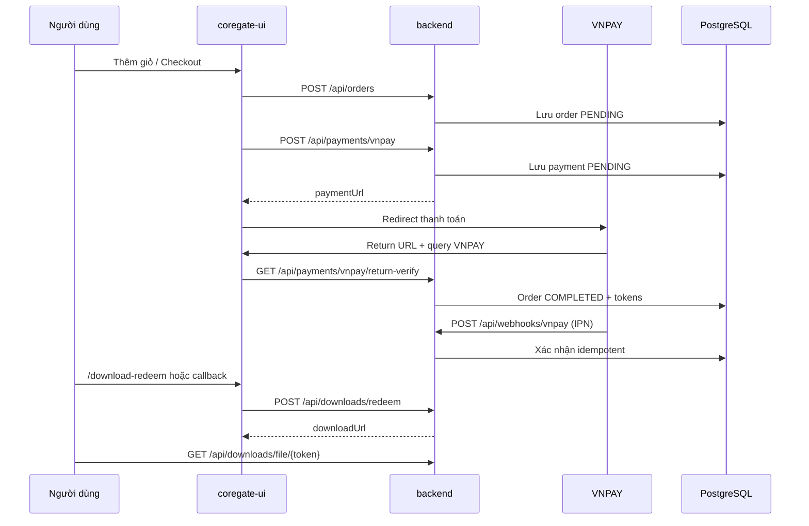

# Coregate Cloud

Nền tảng marketplace sản phẩm số (demo/source code VNPAY) với kiến trúc tách **frontend** và **backend**, tích hợp thanh toán **VNPAY**, quản lý đơn hàng, phân phối file tải sau thanh toán và dashboard phân tích cơ bản.

Dự án hướng tới môi trường **gần production** (Docker Compose, Flyway, PostgreSQL, health check) nhưng vẫn giữ một số phần demo (analytics mock, giá đơn hàng cố định ở backend).

---

## Mục lục

- [Tổng quan](#tổng-quan)
- [Tính năng](#tính-năng)
- [Kiến trúc](#kiến-trúc)
- [Công nghệ](#công-nghệ)
- [Cấu trúc thư mục](#cấu-trúc-thư-mục)
- [Yêu cầu hệ thống](#yêu-cầu-hệ-thống)
- [Cài đặt nhanh (Docker)](#cài-đặt-nhanh-docker)
- [Phát triển local (không Docker)](#phát-triển-local-không-docker)
- [Biến môi trường](#biến-môi-trường)
- [Luồng thanh toán VNPAY](#luồng-thanh-toán-vnpay)
- [Phân phối file download](#phân-phối-file-download)
- [API Backend](#api-backend)
- [Cơ sở dữ liệu](#cơ-sở-dữ-liệu)
- [Giao diện (routes)](#giao-diện-routes)
- [Catalog sản phẩm](#catalog-sản-phẩm)
- [Cấu hình VNPAY Sandbox](#cấu-hình-vnpay-sandbox)
- [Email thông báo](#email-thông-báo)
- [Deploy lên Render](#deploy-lên-render)
- [Xử lý sự cố](#xử-lý-sự-cố)
- [Hạn chế / roadmap](#hạn-chế--roadmap)

---

## Tổng quan

**Coregate Cloud** gồm:

| Thành phần | Mô tả | Port mặc định |
|------------|--------|----------------|
| `coregate-ui` | Next.js 16 — trang chủ, duyệt sản phẩm, giỏ hàng, checkout, callback VNPAY, dashboard | `3000` |
| `backend` | Spring Boot 3 — REST API đơn hàng, thanh toán, webhook IPN, download | `8080` |
| `postgres` | PostgreSQL 16 — lưu orders, payments, token download | `5432` |
| `redis` | Redis 7 — placeholder cache/idempotency (chưa dùng sâu) | `6379` |

Sau khi khách thanh toán thành công, hệ thống:

1. Cập nhật trạng thái đơn → `COMPLETED`
2. Tạo **mã truy cập** (`CG-...`) và **token download** theo từng sản phẩm trong đơn
3. Gửi email mã truy cập (nếu bật SMTP)
4. Khách nhập mã tại `/download-redeem` hoặc xem trực tiếp trên `/payment-callback`

---

## Tính năng

- **Marketplace UI**: trang chủ, browse catalog, chi tiết sản phẩm theo slug, đa ngôn ngữ (EN/VI)
- **Giỏ hàng**: lưu `localStorage`, checkout yêu cầu đăng nhập admin demo
- **Đơn hàng**: tạo order + line items qua API
- **VNPAY**: tạo URL thanh toán, xác minh chữ ký HMAC-SHA512, IPN webhook, return URL verify
- **Download**: mã truy cập 7 ngày, link tải file zip theo `productId`, phục vụ file từ thư mục mount
- **Dashboard**: catalog (localStorage), analytics (dữ liệu mock từ backend)
- **Auth admin đơn giản**: username/password từ biến môi trường (chưa JWT/session server-side đầy đủ)
- **Docker Compose**: build & chạy full stack một lệnh
- **Flyway**: migration schema tự động khi backend khởi động

---

## Kiến trúc



- Frontend gọi backend qua `NEXT_PUBLIC_API_BASE_URL` (trong Docker container UI dùng `http://backend:8080`; trình duyệt local dùng `http://localhost:8080`).
- Một số route Next.js (`app/api/*`) proxy sang backend để tránh CORS trong một số luồng.

---

## Công nghệ

### Backend (`backend/`)

- Java **21**, Spring Boot **3.4.6**
- Spring Web, Data JPA, Security (CORS, permitAll hiện tại), Validation, Mail, Actuator
- PostgreSQL + **Flyway**
- Maven (`mvnw` / `mvnw.cmd`)

### Frontend (`coregate-ui/`)

- **Next.js 16**, React **19**, TypeScript
- Tailwind CSS 4, Radix UI, shadcn/ui
- **pnpm** (lockfile: `pnpm-lock.yaml`)

### Hạ tầng

- Docker & Docker Compose
- PostgreSQL 16 Alpine, Redis 7 Alpine

---

## Cấu trúc thư mục

```
coregate-cloud/
├── .env.example              # Biến dùng chung cho docker-compose
├── docker-compose.yml
├── assets/products/          # Thư mục mẫu file zip (mount vào backend)
├── backend/
│   ├── Dockerfile
│   ├── .env.example
│   ├── pom.xml
│   └── src/main/
│       ├── java/com/coregate/backend/
│       │   ├── api/          # REST controllers
│       │   ├── service/      # Order, VNPAY, Download, Email
│       │   ├── domain/       # JPA entities
│       │   ├── repository/
│       │   └── config/       # Security, CORS
│       └── resources/
│           ├── application.yml
│           └── db/migration/ # V1, V2, V3 Flyway
└── coregate-ui/
    ├── Dockerfile
    ├── .env.example
    ├── app/                  # App Router pages & API routes
    ├── components/
    └── lib/                  # catalog, config, hooks, i18n
```

---

## Yêu cầu hệ thống

| Công cụ | Phiên bản gợi ý |
|---------|------------------|
| Docker Desktop | Mới (WSL2 trên Windows) |
| Java JDK | 21 |
| Node.js | 22+ |
| pnpm | 10+ (`corepack enable`) |
| PostgreSQL | 16 (nếu chạy DB riêng, không Docker) |

---

## Cài đặt nhanh (Docker)

### 1. Sao chép file cấu hình

```bash
cp .env.example .env
cp backend/.env.example backend/.env
cp coregate-ui/.env.example coregate-ui/.env.local
```

Trên Windows (PowerShell):

```powershell
Copy-Item .env.example .env
Copy-Item backend\.env.example backend\.env
Copy-Item coregate-ui\.env.example coregate-ui\.env.local
```

### 2. Chỉnh biến quan trọng

Trong `.env` và/hoặc `backend/.env`:

- `VNPAY_TMN_CODE`, `VNPAY_HASH_SECRET` — lấy từ [VNPAY Sandbox](https://sandbox.vnpayment.vn/)
- `DOWNLOAD_HOST_DIR` — thư mục **trên máy host** chứa file `.zip` (ví dụ `D:/coregate-products`)
- `VNPAY_RETURN_URL` — mặc định `http://localhost:3000/payment-callback`
- `VNPAY_IPN_URL` — URL public tới backend (local cần ngrok, xem [Cấu hình VNPAY](#cấu-hình-vnpay-sandbox))

Trong `coregate-ui/.env.local`:

```env
NEXT_PUBLIC_API_BASE_URL=http://localhost:8080
```

### 3. Chuẩn bị file sản phẩm

Đặt các file zip vào thư mục `DOWNLOAD_HOST_DIR`, khớp mapping backend (ví dụ `payment-demo.zip` cho `vnpay-pay`). Xem [Catalog sản phẩm](#catalog-sản-phẩm).

### 4. Chạy stack

```bash
docker compose up --build
```

| Dịch vụ | URL |
|---------|-----|
| Frontend | http://localhost:3000 |
| Backend health | http://localhost:8080/actuator/health |
| PostgreSQL | `localhost:5432` (user/pass/db: `coregate`) |

Dừng stack: `docker compose down`  
Xóa volume DB: `docker compose down -v`

---

## Phát triển local (không Docker)

### PostgreSQL

Chạy Postgres (Docker riêng hoặc cài local), tạo database `coregate`, cập nhật `DB_URL` trong `backend/.env`:

```env
DB_URL=jdbc:postgresql://localhost:5432/coregate
DB_USERNAME=coregate
DB_PASSWORD=coregate
```

### Backend

```bash
cd backend
# Linux/macOS
./mvnw spring-boot:run

# Windows
mvnw.cmd spring-boot:run
```

Backend đọc biến từ môi trường / `backend/.env` (Spring map `VNPAY_*`, `DB_*`, ...).

### Frontend

```bash
cd coregate-ui
pnpm install
pnpm dev
```

Mở http://localhost:3000 — đảm bảo `NEXT_PUBLIC_API_BASE_URL=http://localhost:8080`.

### Lệnh hữu ích

```bash
# Frontend
pnpm build          # production build
pnpm lint
pnpm typecheck

# Backend
./mvnw test
./mvnw -DskipTests package
```

---

## Biến môi trường

### Root `.env` (Docker Compose)

| Biến | Mặc định | Mô tả |
|------|----------|--------|
| `POSTGRES_DB` | `coregate` | Tên database |
| `POSTGRES_USER` | `coregate` | User Postgres |
| `POSTGRES_PASSWORD` | `coregate` | Mật khẩu Postgres |
| `FRONTEND_PORT` | `3000` | Port UI |
| `BACKEND_PORT` | `8080` | Port API |
| `ADMIN_USERNAME` | `sanglv` | Đăng nhập dashboard demo |
| `ADMIN_PASSWORD` | `Sanglv@123` | Mật khẩu admin demo |
| `VNPAY_TMN_CODE` | — | Mã terminal VNPAY |
| `VNPAY_HASH_SECRET` | — | Secret ký HMAC |
| `VNPAY_PAY_URL` | Sandbox VPCPay | URL cổng thanh toán |
| `VNPAY_RETURN_URL` | `http://localhost:3000/payment-callback` | URL redirect sau thanh toán |
| `VNPAY_IPN_URL` | `http://localhost:8080/api/webhooks/vnpay` | URL IPN (phải public khi test thật) |
| `VNPAY_TIMEZONE` | `Asia/Ho_Chi_Minh` | Múi giờ `vnp_CreateDate` |
| `DOWNLOAD_PUBLIC_BASE_URL` | `http://localhost:8080` | Base URL trong link download API |
| `DOWNLOAD_HOST_DIR` | `./assets/products` | Thư mục host mount vào container (`/app/products`) |
| `DOWNLOAD_STORAGE_DIR` | `/app/products` | Đường dẫn **trong container** backend đọc file |
| `MAIL_ENABLED` | `false` | Bật gửi email |
| `MAIL_FROM` | `no-reply@coregate.local` | Địa chỉ gửi |
| `MAIL_HOST`, `MAIL_PORT`, `MAIL_USERNAME`, `MAIL_PASSWORD` | — | SMTP |
| `MAIL_SMTP_AUTH`, `MAIL_SMTP_STARTTLS` | `true` | Tuỳ chọn SMTP |

### Backend bổ sung

| Biến | Mô tả |
|------|--------|
| `SERVER_PORT` | Port HTTP (8080) |
| `SPRING_PROFILES_ACTIVE` | Profile Spring (`prod` trong `.env.example`) |
| `ALLOWED_ORIGINS` | CORS, phân tách bằng dấu phẩy |
| `VNPAY_IP_ADDRESS` | `vnp_IpAddr` khi tạo payment (mặc định `127.0.0.1`) |

### Frontend

| Biến | Mô tả |
|------|--------|
| `NEXT_PUBLIC_API_BASE_URL` | Base URL backend cho browser |

---

## Luồng thanh toán VNPAY

1. **Tạo đơn** — `POST /api/orders` với `items[]` và `customerEmail` (tuỳ chọn).
2. **Tạo payment** — `POST /api/payments/vnpay` với `orderId`, `amount`, `description`, `returnUrl`.
3. **Redirect** — Frontend chuyển user tới `paymentUrl` từ VNPAY.
4. **Return** — VNPAY redirect về `returnUrl` kèm query `vnp_*`. UI gọi `GET /api/payments/vnpay/return-verify?...`.
5. **IPN** — VNPAY gọi `POST /api/webhooks/vnpay` (form/query params). Backend trả JSON `RspCode` theo spec VNPAY.
6. **Hoàn tất** — Khi `vnp_ResponseCode=00` và amount khớp, order → `COMPLETED`, phát hành mã/link download.

**Lưu ý:** Số tiền gửi VNPAY = `amount * 100` (đơn vị xu). Backend so khớp với `payment.amount` đã lưu.

**Giá đơn hàng:** Backend hiện dùng `DEFAULT_UNIT_PRICE = 100_000` VND/line (không lấy giá từ catalog UI). Giá hiển thị trên UI chỉ mang tính demo — cần đồng bộ nếu triển khai thật.

---

## Phân phối file download

### Sau thanh toán thành công

- Tạo bản ghi `download_access_codes` (mã dạng `CG-...`, hết hạn **7 ngày**).
- Tạo `download_tokens` theo từng `productId` trong đơn.
- Email mã truy cập nếu `MAIL_ENABLED=true` và có `customerEmail`.

### Endpoints

| Method | Path | Mô tả |
|--------|------|--------|
| `GET` | `/api/downloads?orderId={uuid}` | Danh sách link theo order (đã có token) |
| `GET` | `/api/downloads/access-code?orderId={uuid}` | Lấy mã truy cập |
| `POST` | `/api/downloads/redeem` | Body: `{ "accessCode": "CG-..." }` → trả links |
| `GET` | `/api/downloads/file/{token}` | Tải file zip (stream attachment) |

### Cấu hình thư mục file

- **Docker:** `DOWNLOAD_HOST_DIR` trên host → mount read-only vào `/app/products`.
- **Local:** đặt `DOWNLOAD_STORAGE_DIR=./assets/products` hoặc đường dẫn tuyệt đối tới thư mục zip.

Backend từ chối path traversal: file phải nằm trong `storageRoot`.

### Trang UI liên quan

- `/payment-callback` — xác minh return + polling order + hiển thị mã/link
- `/download-redeem` — nhập mã `CG-...` để lấy link tải

---

## API Backend

Base URL: `http://localhost:8080`

### Đơn hàng

**`POST /api/orders`**

```json
{
  "items": [
    { "productId": "vnpay-pay", "quantity": 1 }
  ],
  "customerEmail": "buyer@example.com"
}
```

Response `201`:

```json
{
  "orders": [
    {
      "id": "uuid",
      "customerId": "demo-user",
      "customerEmail": "buyer@example.com",
      "status": "PENDING",
      "totalAmount": 100000,
      "currency": "VND",
      "items": [
        { "productId": "vnpay-pay", "quantity": 1, "unitPrice": 100000 }
      ]
    }
  ]
}
```

**`GET /api/orders/{id}`** — Chi tiết đơn.

### Thanh toán

**`POST /api/payments/vnpay`**

```json
{
  "orderId": "uuid",
  "amount": 100000,
  "description": "Purchase ...",
  "returnUrl": "http://localhost:3000/payment-callback?orderId=uuid"
}
```

Response: `{ "paymentUrl": "...", "txnRef": "CG..." }`

**`GET /api/payments/vnpay/return-verify`** — Query string đầy đủ từ VNPAY return.

### Webhook

**`POST /api/webhooks/vnpay`** — IPN từ VNPAY (`application/x-www-form-urlencoded` / query params). Public, không auth (chỉ verify chữ ký).

### Auth

**`POST /api/auth/sign-in`** — `{ "username", "password" }` → `{ "id", "username", "role" }` hoặc `401`.

**`POST /api/auth/sign-out`** — `204` (placeholder).

### Analytics

**`GET /api/analytics?startDate=YYYY-MM-DD&endDate=YYYY-MM-DD`** — Dữ liệu **mock** cho dashboard.

### Health & metrics

- `GET /actuator/health`
- `GET /actuator/info`
- `GET /actuator/metrics`, `GET /actuator/prometheus` (đã expose)

---

## Cơ sở dữ liệu

Flyway migrations trong `backend/src/main/resources/db/migration/`:

| Migration | Nội dung |
|-----------|----------|
| `V1__init_coregate_schema.sql` | `orders`, `order_items`, `payments`, `payment_ipn_events` |
| `V2__...` | `customer_email` trên orders, bảng `download_tokens` |
| `V3__...` | Bảng `download_access_codes` |

### Trạng thái đơn (`OrderStatus`)

`PENDING` → `COMPLETED` | `FAILED`

### Trạng thái thanh toán (`PaymentStatus`)

`PENDING` → `SUCCESS` | `FAILED`

---

## Giao diện (routes)

| Route | Mô tả |
|-------|--------|
| `/` | Trang chủ |
| `/browse` | Danh sách sản phẩm |
| `/[slug]` | Chi tiết sản phẩm |
| `/checkout` | Giỏ hàng & thanh toán VNPAY |
| `/payment-callback` | Kết quả thanh toán VNPAY |
| `/download-redeem` | Nhập mã download |
| `/login`, `/signup` | Auth UI |
| `/dashboard` | Dashboard seller |
| `/dashboard/catalog` | Quản lý catalog (localStorage) |
| `/dashboard/analytics` | Biểu đồ analytics |

API routes proxy (Next.js): `app/api/orders`, `app/api/payments/vnpay`, `app/api/downloads`, `app/api/analytics`, `app/api/auth/*`.

**Đăng nhập demo:** dùng `ADMIN_USERNAME` / `ADMIN_PASSWORD` từ env.

---

## Catalog sản phẩm

Catalog mặc định trong `coregate-ui/lib/catalog.ts`. Dashboard có thể ghi đè qua `localStorage` key `coregate.catalog.products`.

Mapping **`productId` → file zip** (backend `DownloadService.PRODUCT_ARCHIVES`):

| productId | File zip |
|-----------|----------|
| `vnpay-pay` | `payment-demo.zip` |
| `vnpay-merchant-hosted` | `merchant-hosted-demo.zip` |
| `vnpay-payment-link` | `paymentlink-demo.zip` |
| `vnpay-token` | `token-demo.zip` |
| `vnpay-installment` | `installment-demo.zip` |
| `vnpay-recurring` | `recurring-demo.zip` |
| `vnpay-preauth` | `preauth-demo.zip` |

Thêm sản phẩm mới: cập nhật cả `catalog.ts` (UI) và `PRODUCT_ARCHIVES` (backend), rồi đặt file zip tương ứng.

---

## Cấu hình VNPAY Sandbox

1. Đăng ký tài khoản tại https://sandbox.vnpayment.vn/
2. Lấy **Terminal ID** (`VNPAY_TMN_CODE`) và **Hash Secret** (`VNPAY_HASH_SECRET`)
3. Cấu hình **Return URL** trùng `VNPAY_RETURN_URL` (ví dụ `http://localhost:3000/payment-callback`)
4. Cấu hình **IPN URL** trùng `VNPAY_IPN_URL`

### IPN khi dev local

VNPAY server cần gọi được URL IPN. Trên máy local:

```bash
ngrok http 8080
```

Đặt `VNPAY_IPN_URL=https://<subdomain>.ngrok.io/api/webhooks/vnpay` và khai báo URL này trên portal VNPAY.

Nếu không có IPN, UI vẫn có thể xác nhận qua **return-verify** và **polling** order trên `/payment-callback` (tối đa ~16 giây).

---

## Email thông báo

Bật trong env:

```env
MAIL_ENABLED=true
MAIL_HOST=smtp.gmail.com
MAIL_PORT=587
MAIL_USERNAME=your@gmail.com
MAIL_PASSWORD=app-password
MAIL_FROM=no-reply@yourdomain.com
```

Khi order hoàn tất, backend gửi email chứa **mã truy cập** (`sendDownloadAccessCode`). Cần `customerEmail` hợp lệ lúc tạo order.

Nếu SMTP lỗi, giao dịch vẫn thành công; lỗi chỉ log `WARN`.

---

## Deploy

| Cách | Mô tả |
|------|--------|
| **FREE — Vercel + Render + Neon** | $0, DB lâu dài → **[docs/DEPLOY-FREE.md](docs/DEPLOY-FREE.md)** |
| **Vercel (UI) + Render (API)** | UI nhanh, API + Postgres trả phí → **[docs/DEPLOY-VERCEL-RENDER.md](docs/DEPLOY-VERCEL-RENDER.md)** |
| **Render full stack** | Postgres + backend + UI cùng Render → **[docs/DEPLOY-RENDER.md](docs/DEPLOY-RENDER.md)** (`render.yaml`) |
| **Render chỉ backend** | Dùng với Vercel → [`render.backend.yaml`](render.backend.yaml) |

Tham chiếu biến Render: [`.env.render.example`](.env.render.example).

---

## Xử lý sự cố

### Windows — `spawn cmd.exe ENOENT` khi chạy pnpm/npm

```powershell
$env:ComSpec='C:\Windows\System32\cmd.exe'
```

Sau đó chạy lại `pnpm install` / `pnpm dev`.

### Docker — `dockerDesktopLinuxEngine` pipe not found

Khởi động **Docker Desktop** và đợi engine sẵn sàng trước khi `docker compose up`.

### VNPAY — "VNPAY is not configured"

Thiếu `VNPAY_TMN_CODE` hoặc `VNPAY_HASH_SECRET`. Kiểm tra `.env` và `backend/.env`.

### Download — 404 khi tải file

- File zip không tồn tại trong `DOWNLOAD_HOST_DIR` / `DOWNLOAD_STORAGE_DIR`
- Sai tên file so với mapping `productId`
- Token hết hạn (> 7 ngày)

### CORS

Chỉnh `ALLOWED_ORIGINS` khớp origin frontend (ví dụ `http://localhost:3000`).

### Frontend Docker không gọi được API từ trình duyệt

Trong container, `NEXT_PUBLIC_API_BASE_URL=http://backend:8080` chỉ đúng **server-side**. Trình duyệt user cần URL host: khi dev local dùng `.env.local` với `http://localhost:8080`. Với production, build image với ARG/env phù hợp public URL backend.

---

## Hạn chế / roadmap

- **Security:** API hầu hết `permitAll`; auth admin chưa có JWT/session persistence.
- **Giá:** Backend cố định 100.000 VND/item; chưa đồng bộ giá catalog UI.
- **Analytics:** Endpoint trả dữ liệu giả lập.
- **Redis:** Chưa tích hợp cache/idempotency IPN thực tế.
- **Đa tenant / seller:** `customerId` hardcode `demo-user` khi tạo order.
- **Catalog:** Lưu localStorage phía client, chưa sync server.

---

## Đóng góp

1. Fork / branch từ `main`
2. Commit theo convention repo
3. Mở Pull Request kèm mô tả và test plan

---

## Liên hệ & license

Dự án nội bộ Coregate. Chưa khai báo license công khai trong repo — liên hệ maintainer trước khi phân phối lại.
